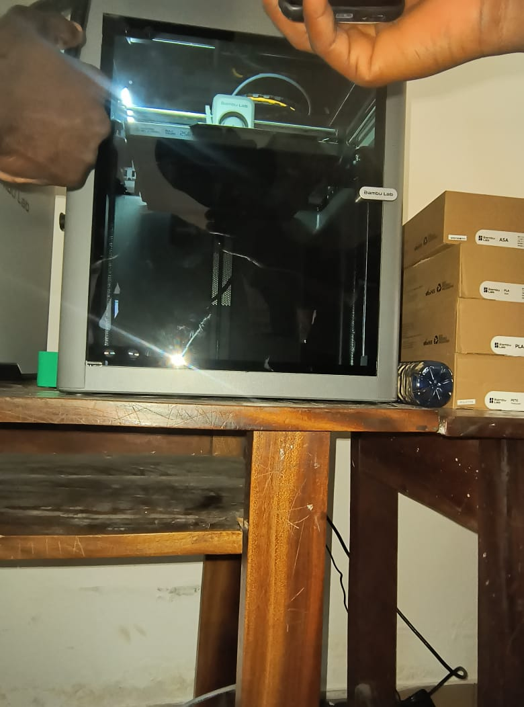
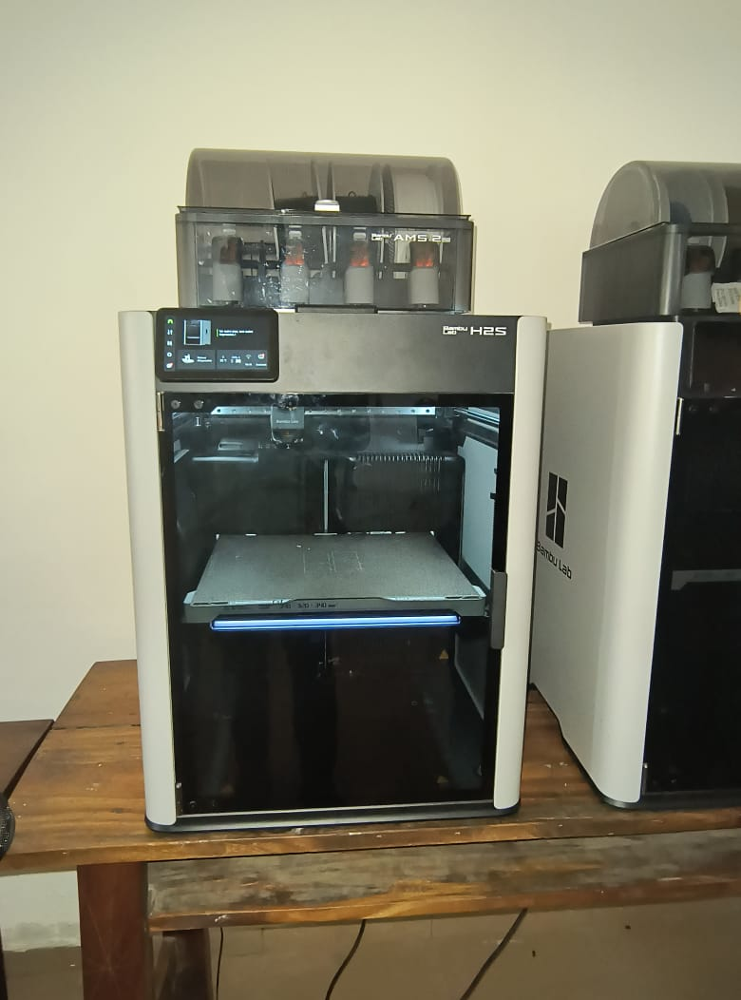
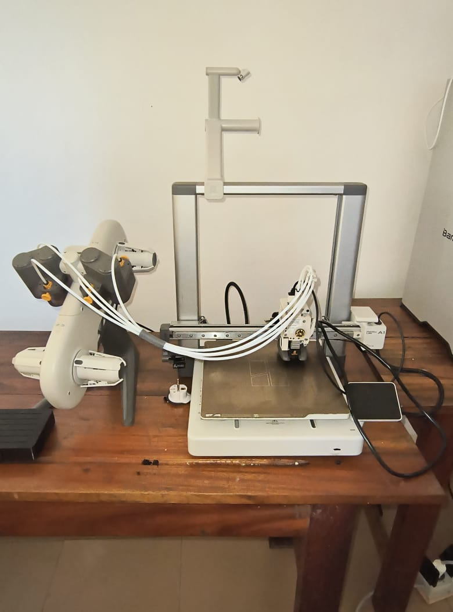

>>>>>>># Journal du 26 Août 2026
*Auteur : **BOUNDJOU Komi Aristide***

 
## **I. Fait aujourd'hui**
##   ***SESSION 1 : ATELIER DE DECOUPE LASER***

### Les fondamentaux de la découpe laser

* C'est quoi le laser?
* Anatomie d'une machine à découpe laser
* Les grandes familles de lasers industriels (CO2, Fibre, Diode, UV)

|  |  |
|---|---|
|||

##   ***SESSION 2 : ATELIER DE D'ELECTRONIQUE***

### Les Bases de l'électronique de base

* les grandeurs électriques de base
* Quelques composantes électroniques et leur utilisation
* Présentation d'un breadboards

##   ***SESSION 3 : ATELIER DE D'IMPRESSION 3D***

### Les Bases et principes de la fabrication par addition

* Introduction à la fabrication additive
* Historique de l'imprezzion 3D
* Les grandes familles de technologie
* Comparatif des technologies

|  |  |  |
|---|---|---|
||||

##   ***SESSION 4 : PROJET***

### Discussions sur les projets de fin
* Mise au point sur les attentes
* Echanges sur quelques idées de projets

## **II. Appris**

*Particulièrement en cette journée , j'ai compris le réel défis qui nous attendait comme FabManagers, la polyvalence, la capacité d'adaptation et le switch entre les différentes poles*

## **III. Raté, puis corrigé**

- Néant

## **IV. Décidé**

- Je rélise qu'il me faut faire un réel travail personnel en dehors des horaires imposées, des recherches, des tutoriels

## **V. À faire demain**

- Continuité sur les modules de base

