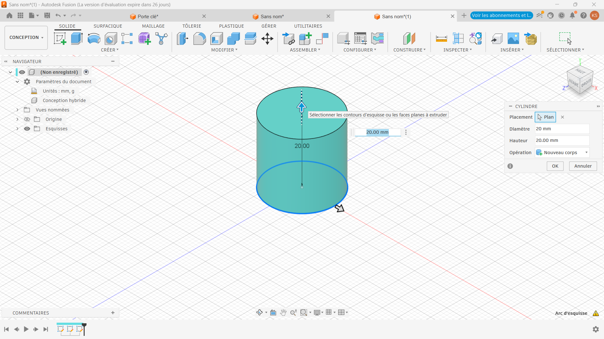
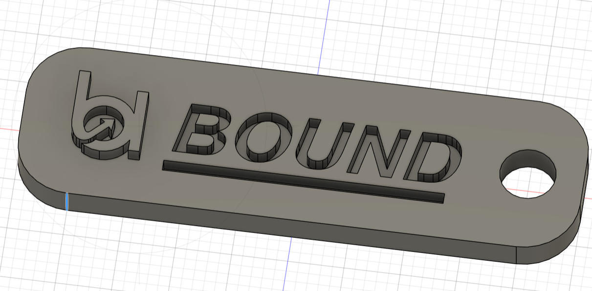
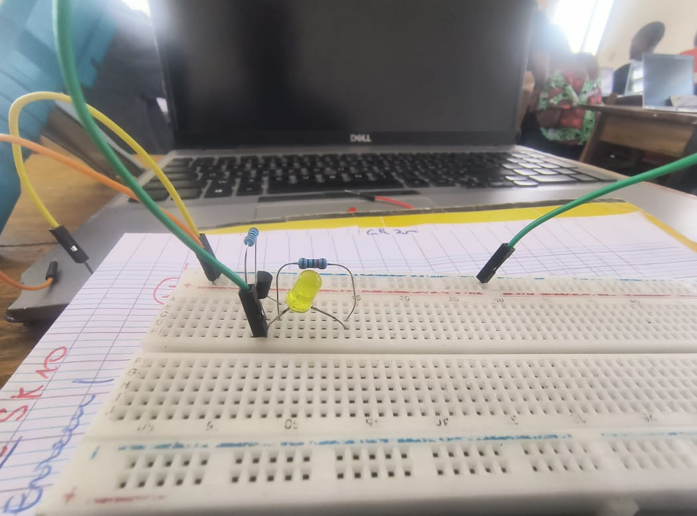

>>>>>>># Journal du 1er Septembre 2026
*Auteur : **BOUNDJOU Komi Aristide***

## Fait aujourd'hui

- Modélisation d'un cylindre en 3D
- Modélisation d'une porte clé

- Impression DTF
- Manipulation electronique avec les beardbord

## Les appris du jour:

### Modélisation par Fusion 360
#### Modélisation d'un cylindre en 3D à partir de Fusion 360:
   
     
   - Par la méthode d'extruision

#### Modélisation d'une porte clé:
  - Modélisation par extrusion d'une porte clé
     - Modélisation d'un rectangle
     - Modélisation d'un cylindre centré au bord du rectangle
     - Modélisation d'un texte sur le rectangle et extrusion du texte
   
  - Modélisation fait par congé d'un objet modélisé

|||
   

### Atelier découpe laser:
- Impression DTF avec Xtool

### Atelier d'électronique:
- Familiarisation avec les beardbord

