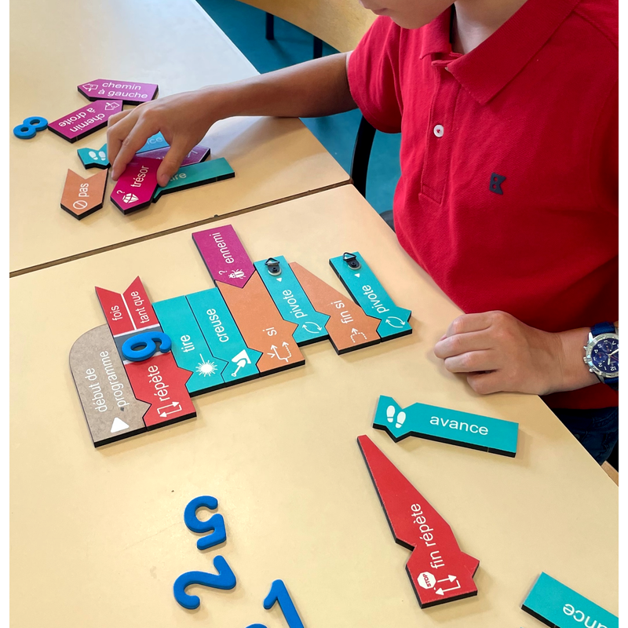

>>>>>>># Journal du 2 Septembre 2026
*Auteur : **BOUNDJOU Komi Aristide***

## Fait aujourd'hui

- Réalisation d'une esquisse du projet : detecteur de fuite de gaz dans une cantine scolaire.
- Algirithmes débranchés
- Assemblage d'un robot M Bot2

## Les appris du jour:
### Projet: Détection de gaz dans une cantine scolaire
- Esquise du dispositif choisi et ajustement de la visualisation première du projet. 

### Algorithme débranché:

- Elle consiste à Apprendre à pensé comme la machine sans ordinateur
- Elle consiste à Manipulation des briques en bois pour construire des séquences d'instruction
- Elle regoupe les même notions que dans un programme: ordre, conditon, répétition
- Elle a pour objectif d'apprendre la logique avant d'écrire une seul ligne de code
- Les critèrs des algorithme se presente comme suite:
  - Suite ordonnée fini d'instructions
  - Un nombre fini d'étapes
  - Des instructions précis qui résolvent un problème donné

### Historique des algorithmes
|Personalité|Année|Réalisation|
|--|--|--|
|Euclide|-300|Algorithme du PGCD|
|Al Khwârizmi|-825|Orignine du mot "algorithme"|
|Blaise Pascal|1652|Première machine à calculer|
|Ada Lovelace|1843|Premier programme écrite pour une machine|
|Alan Turing|1936|- Calcul automatique; invention du model de "machine universelle"|
|Margaret Hamilton|1969|Dévélopement de l'algorithme d'Appolo 11|

### Atelier d'électronique:
- Assemblage d'un robot M Bot2
- [Lien tutoriel Youtube: building mBot2](https://youtu.be/qEUjg-KVvko)
- Code mBlock

