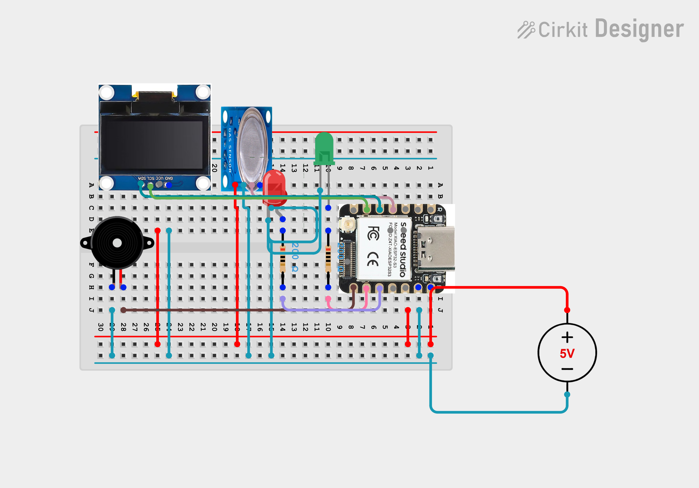
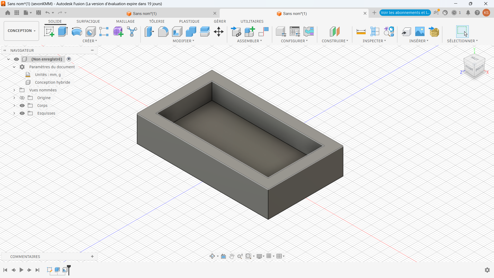
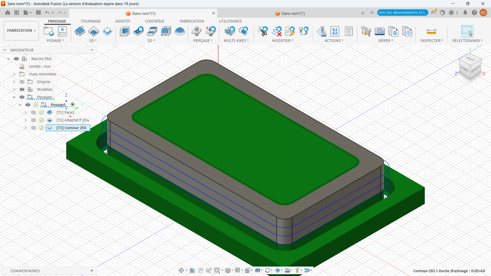
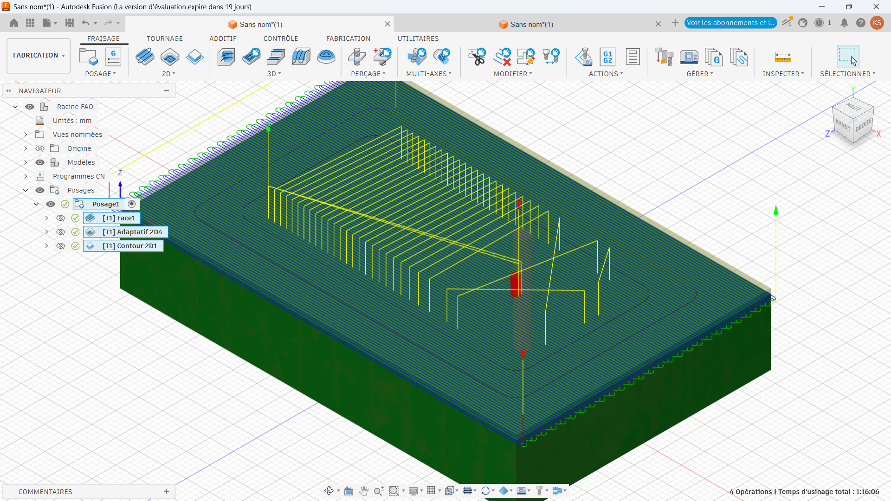
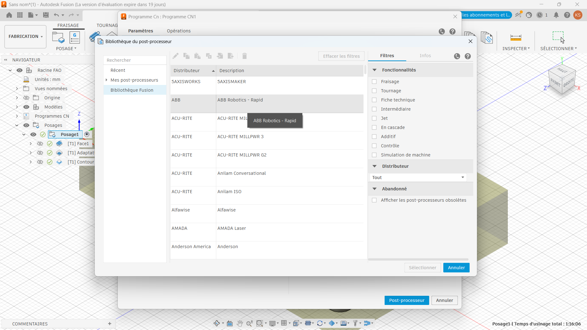
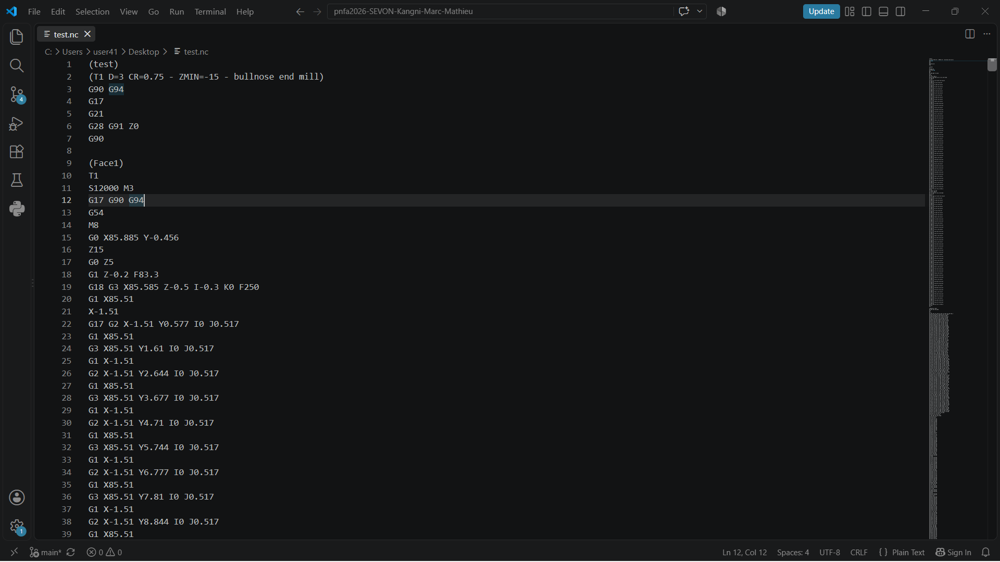

>>>>>>># Journal du 8 Septembre 2026
*Auteur : **BOUNDJOU Komi Aristide***

### Etude de projet:
- Etude du projet: Projet de détection de gaz dans une cantine scolaire aliment par des pilles a littium 
- Cablage virtuel du projet test sur cirkit

- Implémentation du code pilote de l'écran
- Implémentation du code python sur l'ESP32 S3
- Cablage du des conposants sur le BreadBord et début des simulations

### Conception 3D :
- FAO & usage du CNC
- Parametrage de la fraiseuse CNC

### Fabrication assister par ordinateur :
- Le flux de travail du FAO sur Fusion 360
  1. Setuo

  2. Choix des outils 
  3. Opération d'usinage : ( Face, l'ébauche, la stratégie d'ébauche, la finition)
 
  4. Simulation : (Pour les vérifierifications avant d'usiner)
 - 
 
  5. Post-traitement : (il consiste à inserer le G-code dans machine)

 

## Programmé sur démain:

- Poursuite du test du prototype 
- Correction des erreurs dû au composant ou au 
