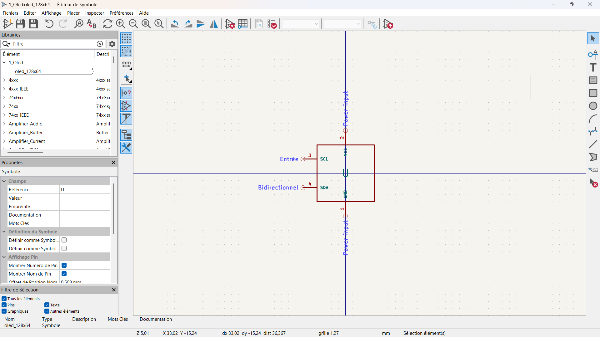
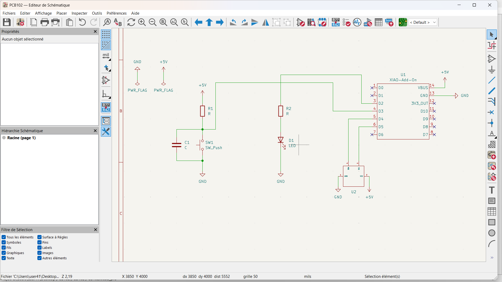
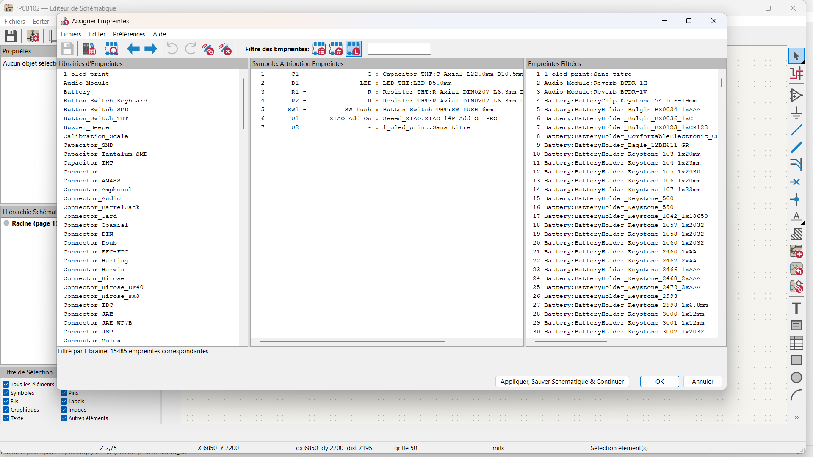
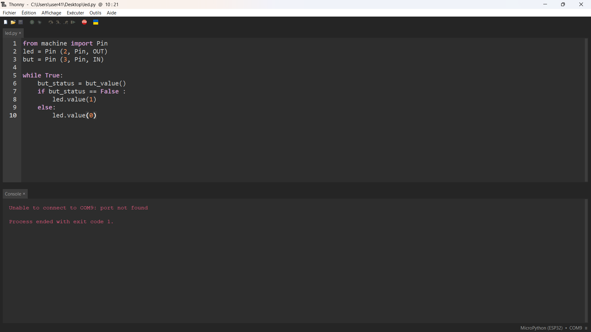

>>>>>>># Journal du 9 Septembre 2026
*Auteur : **BOUNDJOU Komi Aristide***

- Conception d'un circuit PCB
- notions de programation informatique
- Edition d'un code Mini-python pour l'écran OLED

### Conception d'un circuit PCB :

- Schématisation d'un circuit électronique
- Importation des librairies dans le logiciel **Kicard**

- Créaction de symboles et d'emprunts des composants électroniques

 
 

### Rappel des notions de programation informatique
  - Les Variables
  - Les structures conditionnelles
  - Les boucles
  - Les commentaires
  - Les fonctions
  - Les oppérateurs (arithmétiques,logiques, comparaison, affectations)

- Edition d'un code Mini-python pour l'écran OLED

