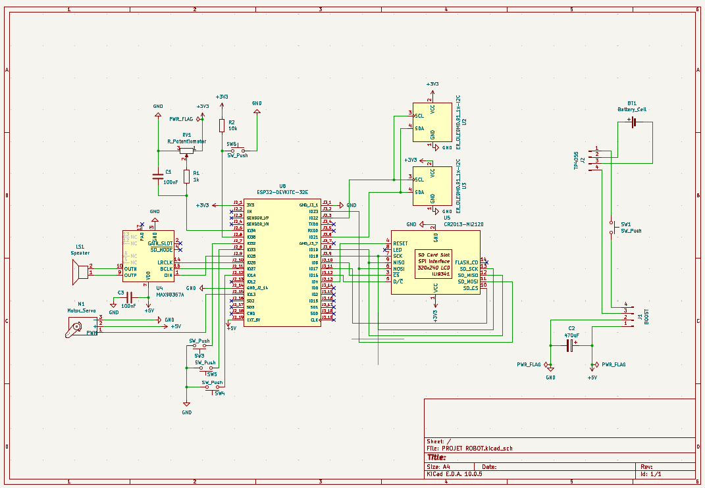

>>>>>>># Journal du 10 Septembre 2026
*Auteur : **BOUNDJOU Komi Aristide***

## Fait aujourd'hui
**Projet de groupe**
- Récupération des composants et création du schéma électronique complet.
- Câblage des liaisons et vérification des connexions électriques (ERC)
- Routage des pistes sur le PCB pour relier tous les composants

# Appris

- L’organisation des pins SPI pour ne pas avoir de conflit entre SD et ILI9341L
- importance de grouper les composants pour réduire la longueur des pistes et croiser le moins possible.

# Raté, puis corrigé

- Conflits de pistes lors du 1er routage, on a réorganisé les composants et séparé alimentation et signal.

## Décidé

- Se concentrer sur l'essaie sur table avec un breadbord

## À faire demain

- Vérification finale pour traquer les erreurs d'isolement ou les pistes non connectées.