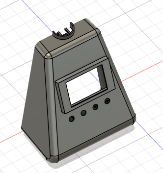
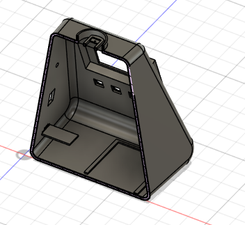
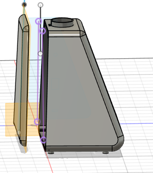
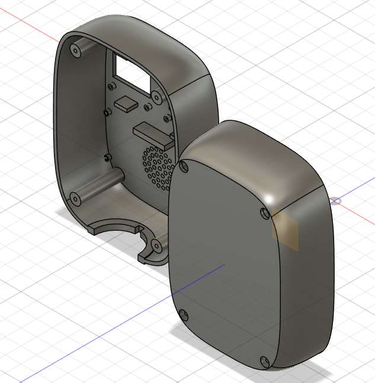
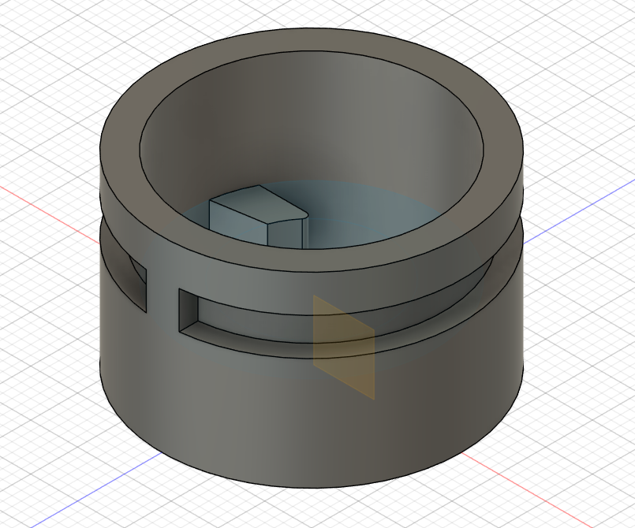
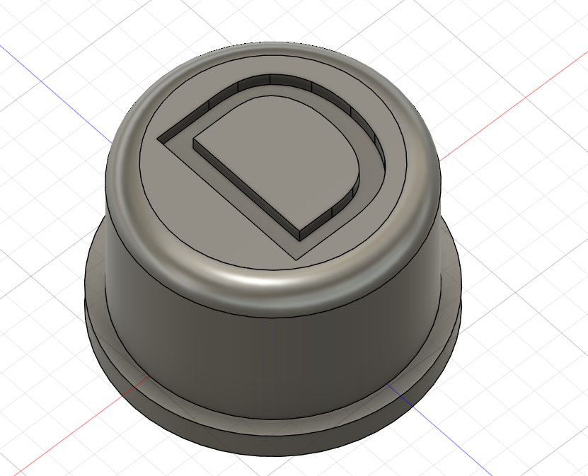

>>>>>>># Journal du 12 Septembre 2026
*Auteur : **BOUNDJOU Komi Aristide***

## Fait aujourd'hui
**Projet de groupe**

- Conception en 3D du corps du robot QCM.

# Appris
J'ai amélirer mes conception en conception 3D

# Raté, puis corrigé

## Décidé

- Travailler sur le montage électronique

## À faire demain

- Impression 3D de nos pièces