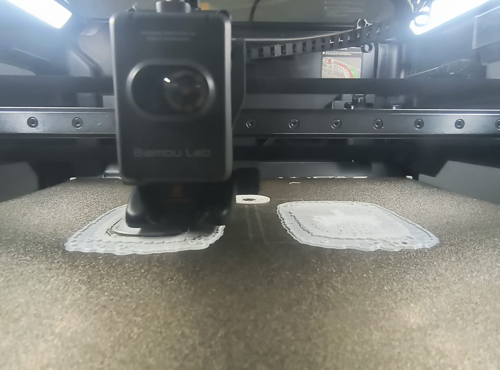
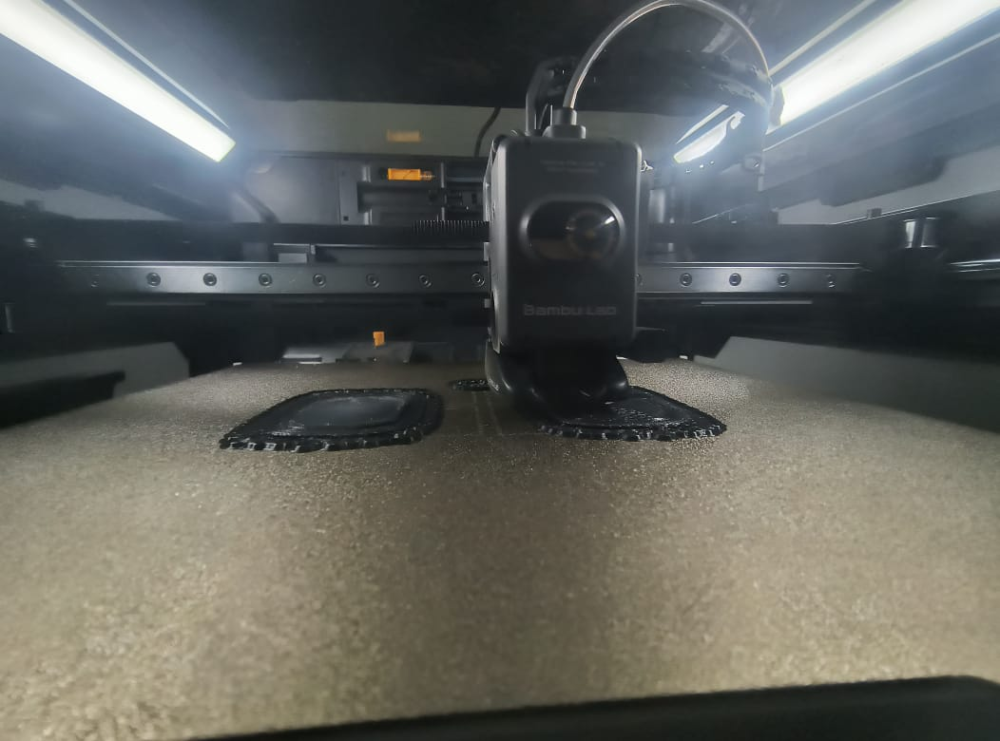
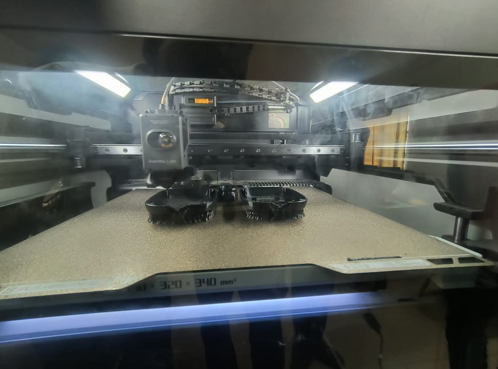

>>>>>>># Journal du 14 Septembre 2026
*Auteur : **BOUNDJOU Komi Aristide***

## Fait aujourd'hui
**Projet de groupe**
-  Passage du modèle 3D du corps du robot dans Bambou Studio (slicer) et configuration des paramètres d'impression.
- Démarrage de l'impression 3D de la base/corps du robot.

# Appris

- Meilleure compréhension des paramètres du slicer (densité de remplissage, supports) pour assurer la solidité du corps du robot tout en optimisant le temps d'impression.

# Raté, puis corrigé

-  un problème d'orientation de la pièce/supports manquants est survenu qui a été réglé avec  réajustement des paramètres de la pièce dans le slicer.
- Le choix du mauvais filament    qui est normalement utiliser pour faire les supports.
- L'exterieur de la piece imprimée est rougeux.

## Décidé

- Le comportement du robot en simulation est conforme aux attentes, le circuit et le code associés.

## À faire demain

- Récupérer la pièce imprimée, retirer les supports et vérifier la précision dimensionnelle du corps du robot.
- Monter le servomoteur, la carte de contrôle (validée sur Wokwi).
- Téléverser le programme validé dans le vrai microcontrôleur et effectuer les premiers tests.