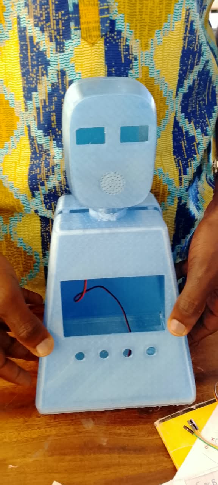
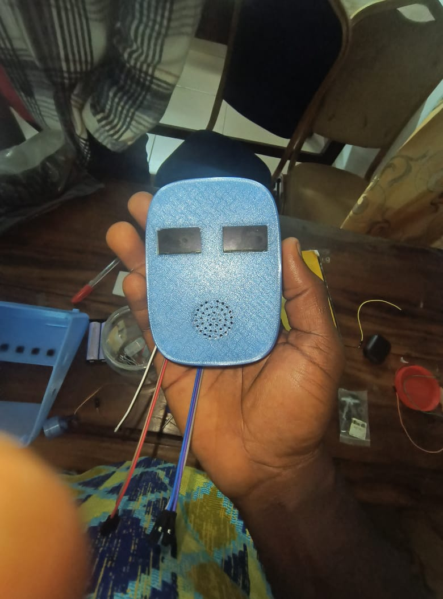

# Journal du 15 Septembre 2026
*Auteur : **BOUNDJOU Komi Aristide***

## Fait aujourd'hui

**Projet de groupe & Électronique**

* Récupération du corps du robot fraîchement imprimé en 3D, nettoyage des supports et vérification de la précision dimensionnelle.
* Intégration physique du servomoteur de la tête mobile dans son logement.
* Identification et préparation du câblage du potentiomètre rotatif (modèle B5K) pour le montage de test ou d'interface de réglage.
* Assemblage des premiers composants électroniques sur le circuit (microcontrôleur ESP32, écrans et modules).

## Appris

* Maîtrise du rôle des trois broches d'un potentiomètre rotatif (connexion GND, sortie curseur sur l'ADC, et alimentation VCC/) pour l'utiliser correctement en diviseur de tension.

## Raté, puis corrigé

* Un léger ajustement mécanique a été nécessaire pour insérer parfaitement le servomoteur à cause de résidus de supports d'impression restés dans la cavité, résolu par un ébavurage minutieux.

## Décidé

* Le positionnement définitif du câblage interne pour laisser un accès facile aux broches de test de l'ESP32 sans bloquer la rotation du servo de la tête.

## À faire demain

* Téléverser le programme MicroPython validé dans l'ESP32 physique.
* Effectuer les premiers tests combinés du servomoteur, des écrans et de la lecture du potentiomètre.
* Documenter le comportement global du robot assemblé.