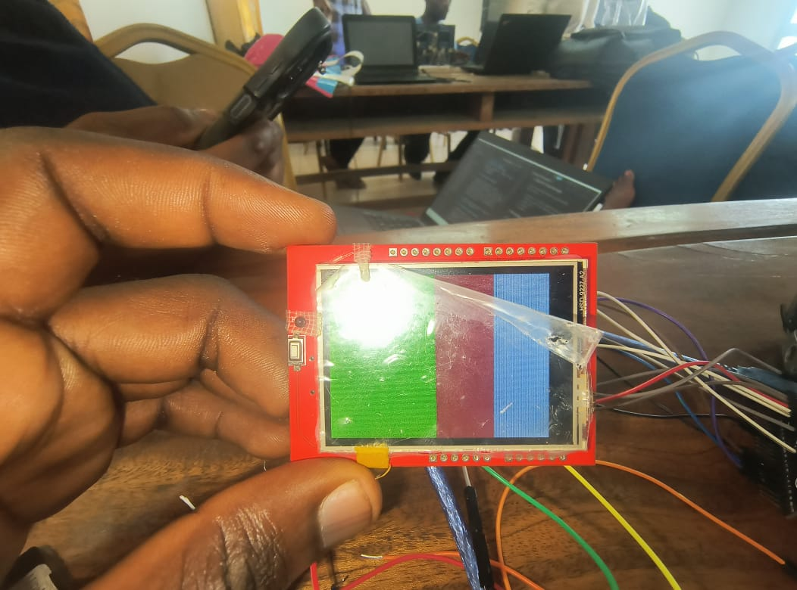
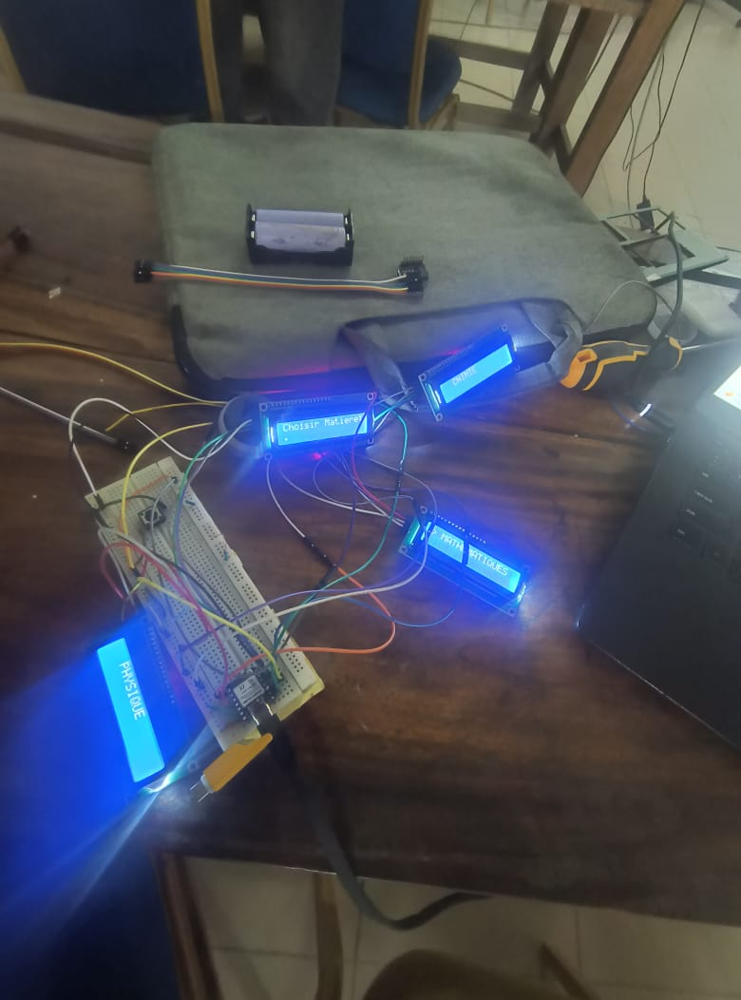

# Journal du 16 Septembre 2026

*Auteur : **BOUNDJOU Komi Aristide***

## Fait aujourd'hui

**Électronique & Gestion des composants**

* Point sur l'état d'avancement du projet et inventaire des composants disponibles en vue de l'assemblage de la partie électronique.
* Analyse des contraintes matérielles : impossibilité de procéder au montage final et aux tests sur le robot en raison  d'un manque d'écrans TFT sur l'établi.
* Réorganisation de la séance pour se concentrer sur la vérification théorique des schémas de câblage et la simulation des scripts de contrôle.

## Appris

* Importance de bien anticiper la chaîne d'approvisionnement des composants critiques (comme les afficheurs) pour éviter les temps morts dans le calendrier d'assemblage matériel du robot.

## Raté, puis corrigé

* Blocage dans l'avancement physique de l'intégration électronique à cause de l'absence des écrans, contourné en approfondissant l'optimisation du code de l'ESP32 et la relecture des schémas sur KiCad.

## Décidé

* Report de l'assemblage complet des écrans et des tests dynamiques finaux à l'arrivée du matériel manquant.
* Poursuite de la préparation logicielle et de la documentation en attendant.

## À faire demain

* Vérifier la disponibilité des écrans pour débloquer le montage.
* Continuer les tests unitaires sur les éléments disponibles (ESP32, servomoteur et potentiomètre B5K) de manière isolée.
* Rédiger les notes d'étape pour le suivi du projet de groupe.