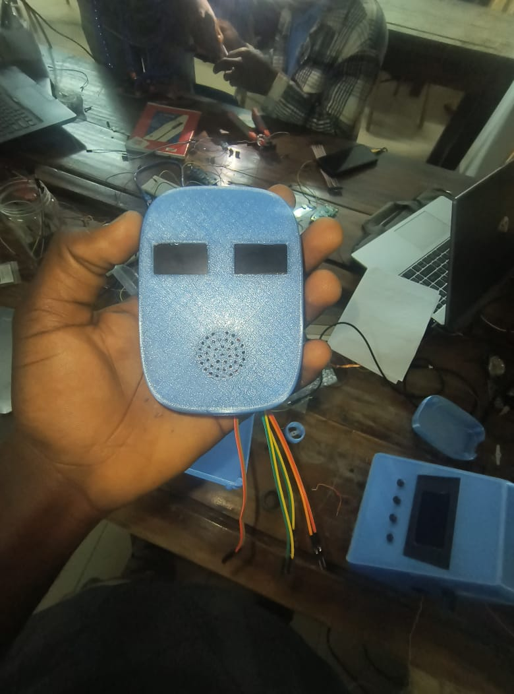
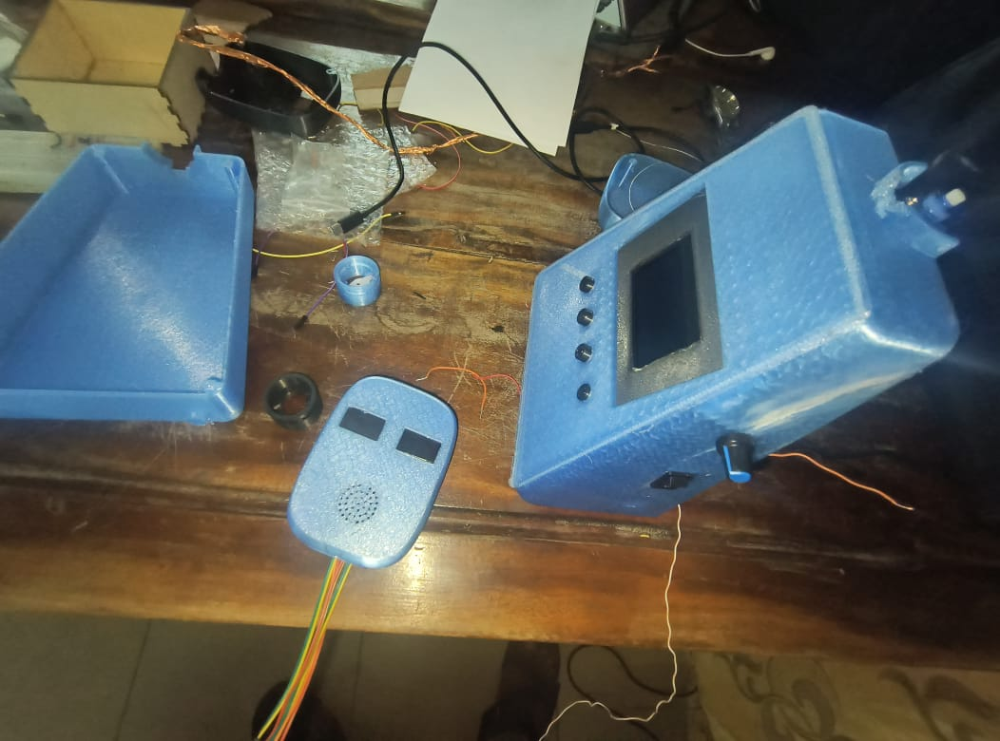

# Journal du 17 Septembre 2026

*Auteur : **BOUNDJOU Komi Aristide***

## Fait aujourd'hui

**Électronique & Finalisation du projet**

* Réception tardive en fin de journée de l'écran de remplacement (un modèle OLED 2.42", différent de celui initialement demandé mais adapté en urgence).
* Course contre la montre en soirée pour câbler cet écran sur l'ESP32, intégrer le servomoteur de la tête et finaliser les connexions.
* Assemblage final de tous les composants électroniques à l'intérieur du corps 3D du robot pour achever le prototype.

## Appris

* Capacité d'adaptation rapide face à un changement de matériel de dernière minute (adaptation du code et du brochage pour un écran OLED 2.42").
* Gestion du stress et des imprévus lors de la dernière journée de bouclage d'un projet technique.

## Raté, puis corrigé

* Incompatibilité initiale de la taille et de la bibliothèque d'affichage avec le nouvel écran OLED 2.42", résolue en modifiant rapidement les paramètres d'initialisation dans le code MicroPython de l'ESP32.

## Décidé

* Validation de la version finale du robot malgré les modifications de dernière minute, clôturant ainsi le projet de groupe.

## À faire demain

* Rangement de l'établi après la clôture du projet.
* Préparation de la présentation finale et du rapport de synthèse pour la restitution.